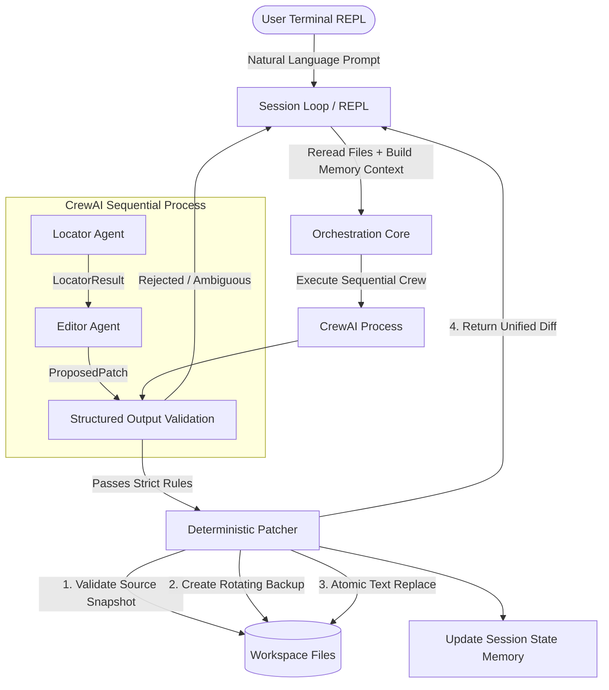

# CrewAI Conversational HTML/CSS Editing Agent

A specialized, local-first conversational CLI editing agent built with Python, CrewAI, Pydantic, and Groq. The agent accepts natural language editing requests in a long-running terminal session and applies exact, single-file HTML or CSS modifications deterministically.

---

## Table of Contents

- [Overview](#overview)
- [Scope & Exclusions](#scope--exclusions)
- [Architecture](#architecture)
- [Per-Turn Execution Flow](#per-turn-execution-flow)
- [Repository Structure](#repository-structure)
- [Requirements](#requirements)
- [Setup & Installation](#setup--installation)
- [Environment Configuration](#environment-configuration)
- [Model Selection](#model-selection)
- [Usage](#usage)
- [Conversational Editing & Memory](#conversational-editing--memory)
- [Safety Guarantees](#safety-guarantees)
- [Testing](#testing)
- [Restoring Workspace](#restoring-workspace)
- [Troubleshooting](#troubleshooting)

---

## Overview

The **CrewAI Conversational HTML/CSS Editing Agent** provides a terminal REPL loop where users interactively edit allowed workspace HTML and CSS files using plain English.

Unlike unconstrained code-generation assistants, this project operates under strict safety and determinism boundaries:
- **Two-Agent Crew**: A **Locator** agent finds the target file and exact source substring; an **Editor** agent produces a single precise replacement patch.
- **Deterministic Validation & Execution**: Python validates all structural and path constraints, generates rotating backups (`.bak`), applies atomic writes, and renders unified diffs.
- **Strict Structured Outputs**: Pydantic models strictly enforce data shapes and prohibit arbitrary LLM text formats.
- **Local-First & Reread Source**: Workspace HTML/CSS files are reread directly from disk on every single turn to maintain the true file state.

---

## Scope & Exclusions

### In-Scope Capabilities
- Direct single-turn HTML edits (text content, attribute values, tags).
- Direct single-turn CSS edits (property values, selectors, declarations).
- Conversational follow-up requests ("Make it bigger", "Change the same button again", "Even darker").
- Rejection of ambiguous, out-of-scope, or dangerous instructions with clear user feedback.
- Automatic rotating file backup creation (`index.html.bak`, `index.html.bak.1`).
- Unified diff output display for applied edits.

### Explicit Exclusions
- **No JavaScript support**: JavaScript files (`.js`) and inline event handlers are strictly out of scope and rejected.
- **No multi-file edits**: Exactly one file is edited per turn. Requests spanning multiple files are rejected.
- **No visual rendering or browser automation**: Execution is terminal-based without browser drivers or DOM layout calculation.
- **No unconstrained code generation**: All edits must match existing source content exactly.

---

## Architecture

The project follows a modular, pipeline-based design:



---

## Per-Turn Execution Flow

1. **Input Collection**: User enters an instruction at the REPL prompt (`web> `).
2. **Fresh Source Read**: Python reads all allowlisted HTML/CSS files directly from disk.
3. **Memory Context Assembly**: Recent successful edits and target metadata (file, selector, property) are formatted into a context string.
4. **Crew Execution**:
   - **Locator Task**: Identifies target file, selector/property, and exact source snippet (`LocatorResult`).
   - **Editor Task**: Receives locator context and produces exact `old_text` and `new_text` (`ProposedPatch`).
5. **Python Validation**:
   - Verify task completion and Pydantic structured output.
   - Verify allowlisted file paths.
   - Verify `old_text` exists **exactly once** in the current file source.
   - Verify source snapshot has not changed.
6. **Safe File Modification**:
   - Create rotating backup (`filename.bak`, `filename.bak.1`).
   - Perform atomic write to target file.
   - Generate and print unified diff.
7. **Session State Record**: Record turn metadata for downstream follow-up awareness.

---

## Repository Structure

```
.
├── src/
│   └── web/
│       ├── __init__.py
│       ├── main.py            # CLI entry point (`web`)
│       ├── session.py         # Terminal REPL loop
│       ├── orchestration.py   # Turn processing and crew execution wrapper
│       ├── crew.py            # CrewAI Agents and Tasks configuration
│       ├── models.py          # Pydantic schemas (LocatorResult, ProposedPatch)
│       ├── state.py           # SessionState memory and history limit
│       ├── settings.py        # Environment & pydantic-settings config
│       ├── tools/
│       │   ├── __init__.py
│       │   └── patcher.py     # Deterministic backup, diff & atomic replace
│       └── workspace/         # Default target web workspace
│           ├── index.html
│           └── style.css
├── tests/
│   ├── test_crew.py
│   ├── test_integration.py   # End-to-end mocked integration tests
│   ├── test_models.py
│   ├── test_orchestration.py
│   ├── test_patcher.py
│   ├── test_reliability.py
│   ├── test_session.py
│   ├── test_settings.py
│   ├── test_state.py
│   └── test_validation.py
├── .env.example               # Template environment configuration
├── pyproject.toml             # Project setup and dependencies
├── DEMO.md                    # Supervisor demonstration script
└── README.md                  # Project documentation
```

---

## Requirements

- **Python**: `>=3.10, <3.14` (Python 3.11 or 3.12 recommended).
- **Package Manager**: [`uv`](https://github.com/astral-sh/uv) (recommended) or standard `pip`.
- **API Access**: Groq API Key (`GROQ_API_KEY`).

---

## Setup & Installation

1. **Navigate to the web project directory**:
   ```bash
   cd web
   ```

2. **Install dependencies using `uv`**:
   ```bash
   uv sync
   ```

---

## Environment Configuration

Create a `.env` file in the `web/` directory based on `.env.example`:

```bash
cp .env.example .env
```

Configure your `.env` variables:

```env
GROQ_API_KEY=gsk_your_actual_groq_api_key_here
GROQ_MODEL=groq/llama-3.3-70b-versatile
PROJECT_ROOT=src/web/workspace
ALLOWED_FILES=index.html,style.css
BACKUP_LIMIT=3
SESSION_HISTORY_LIMIT=5
```

---

## Model Selection

This application is optimized for **Groq** models via CrewAI. The default recommended model is:
- `groq/llama-3.3-70b-versatile`

Alternative supported Groq models:
- `groq/llama3-70b-8192`
- `groq/mixtral-8x7b-32768`

---

## Usage

### Running the Terminal REPL

Launch the agent with `uv`:

```bash
uv run web
```

Or run via python module:

```bash
uv run python -m web.main
```

### REPL Commands

- `exit` or `quit`: Terminate session cleanly.
- `help`: Display help and examples.
- `status`: Show current session history and last target.
- `<instruction>`: Enter any natural language HTML/CSS editing request.

---

## Conversational Editing & Memory

The session maintains a bounded history of successful turns (default `SESSION_HISTORY_LIMIT=5`). Memory tracks:
- **Last Target**: File, selector, property, and summary of the previous edit.
- **Context Injection**: When a prompt matches follow-up patterns ("make it darker", "rounder", "change it again"), recent target metadata is passed to the locator agent.
- **Source Reread**: Memory never caches file contents. File contents are reread directly from disk on every turn.

---

## Safety Guarantees

1. **Path Traversal Protection**: Only allowlisted relative files (`index.html`, `style.css`) within `PROJECT_ROOT` can be accessed or modified.
2. **Exact Single Match**: `old_text` must appear **exactly once** in the target file. If 0 or >1 matches are found, the patch is rejected without modifying files.
3. **Rotating Backups**: File backups (`.bak`, `.bak.1`) are created prior to writing changes.
4. **Atomic File Write**: Files are written to a temporary file in the same directory before atomic replacement to prevent partial writes.
5. **No Secret Leaks**: Provider/network errors redact API keys and sensitive tokens before displaying diagnostic messages to the terminal.

---

## Testing

The project contains unit and integration tests with **100% mocked LLM calls** (no API usage or network dependencies).

Run all tests:

```bash
uv run pytest tests/ -v
```

Run only integration tests:

```bash
uv run pytest tests/test_integration.py -v
```

---

## Restoring Workspace

To reset workspace files to clean initial states after testing or running demo turns:

```bash
git checkout src/web/workspace/
rm -f src/web/workspace/*.bak*
```

---

## Troubleshooting

| Problem | Cause | Resolution |
| :--- | :--- | :--- |
| `GROQ_API_KEY is not set` | Missing `.env` or invalid key | Ensure `.env` exists in `web/` directory with a valid `GROQ_API_KEY`. |
| `patch file must be one of allowlisted workspace files` | Request targeted a non-allowlisted file | Check `ALLOWED_FILES` setting or request edits only to `index.html` or `style.css`. |
| `old_text matched 0 times` | Source file was modified externally or text changed | Verify file content; re-issue instruction relative to current source. |
| `old_text matched 2 times` | Selected snippet is not unique | Provide a more specific description or contextual tag/selector. |
