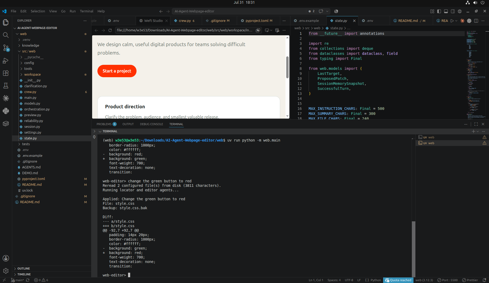
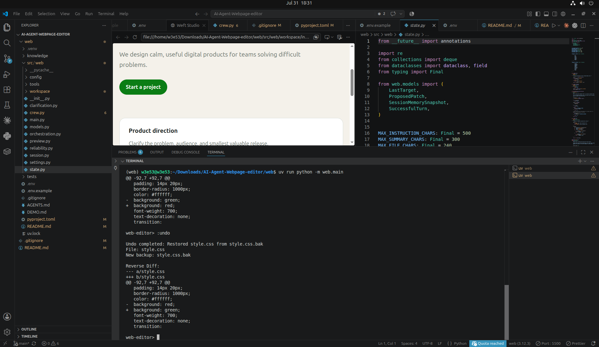

# CrewAI Conversational HTML/CSS Editing Agent

A specialized, local-first conversational CLI editing agent built with Python, CrewAI, Pydantic, Groq, an embedded read-only Gemini CLI patch reviewer, interactive clarification workflows, deterministic HTML/CSS syntax validation (`html5lib` & `tinycss2`), patch preview mode, and safe undo capabilities.

---

## Table of Contents

- [Overview](#overview)
- [Scope & Exclusions](#scope--exclusions)
- [Architecture](#architecture)
- [Preview, Validation & Recovery](#preview-validation--recovery)
- [Conversational Clarification Workflow](#conversational-clarification-workflow)
- [Gemini CLI Patch Reviewer](#gemini-cli-patch-reviewer)
- [Per-Turn Execution Flow](#per-turn-execution-flow)
- [Repository Structure](#repository-structure)
- [Requirements](#requirements)
- [Setup & Installation](#setup--installation)
- [Environment Configuration](#environment-configuration)
- [REPL Colon Commands](#repl-colon-commands)
- [Safety Guarantees](#safety-guarantees)
- [Testing](#testing)
- [Restoring Workspace](#restoring-workspace)
- [Troubleshooting](#troubleshooting)

---

## Overview

The **CrewAI Conversational HTML/CSS Editing Agent** provides an interactive terminal REPL loop where users modify allowlisted HTML and CSS workspace files using natural language instructions.

Unlike unconstrained code-generation assistants, this project operates under strict safety, structural, and determinism boundaries:
- **Two-Agent Crew**: A **Locator** agent finds the target file and exact source substring; an **Editor** agent produces a single precise replacement patch.
- **Deterministic Syntax Validation**: Python parses complete resulting HTML (`html5lib`) and CSS (`tinycss2`) documents *in memory* before any backup or write operation occurs.
- **Patch Preview & Automatic Modes**: `PATCH_MODE=preview` holds pending diffs for interactive confirmation (`:apply` or `:cancel`) without modifying files prematurely.
- **Safe Undo**: `:undo` restores previous source file versions from rotating backups (`.bak`) using atomic file operations and reverse diff rendering.
- **Conversational Clarification Workflow**: Interactive disambiguation prompts when an instruction matches multiple candidate elements or properties.
- **Embedded Read-Only Gemini Reviewer**: An optional Gemini CLI tool reviews candidate patches in read-only plan mode (`--approval-mode plan`) inside a sanitized subprocess.
- **Strict Structured Outputs**: Pydantic models strictly enforce data schemas and prohibit arbitrary unstructured LLM responses.
- **Local-First & Reread Source**: Workspace HTML/CSS files are reread directly from disk on every single turn to prevent drift.

---

## Screenshots

### Natural-language CSS edit

The agent receives a conversational instruction, locates the relevant CSS rule, applies the change, creates a backup, and prints a unified diff.



### Safe undo

The `:undo` command restores the previous file version from backup and displays the reverse diff without requiring another LLM call.



---

## Scope & Exclusions

### In-Scope Capabilities
- **Allowed Source Files**: Localized HTML (`.html`) and CSS (`.css`) files configured in `ALLOWED_FILES` within `PROJECT_ROOT` (default: `index.html`, `style.css`).
- **Targeted Modifications**: Text content updates, HTML element structure modifications, inline styles, CSS selectors, rule blocks, colors, layout rules, and typography.
- **Disambiguation**: Interactive clarification prompt when an edit request applies to multiple candidate elements or selectors.
- **Safety Controls**: Pre-write unique substring matching with newline normalization, syntax validation, diff previews, rotating backups, and atomic undo operations.

### Explicit Exclusions
- **Unallowed File Types**: JavaScript files (`.js`), backend logic (`.py`, `.php`), database schemas, shell scripts, or arbitrary executable creation.
- **Out-of-Boundary Access**: Any attempts to read, edit, or create files outside the explicit `ALLOWED_FILES` list in `PROJECT_ROOT`.
- **Broad Redesigns**: Automated structural redesigns across unmanaged files or complex framework code generation.
- **Unverified Writes**: No file modification occurs without passing strict substring verification and syntax parsing.

---

## Architecture


### Core Architecture Components

1. **Session Loop (`web.session`)**: Drives the interactive prompt (`web-editor> `, `preview> `, `clarify> `), processes colon commands, and coordinates reread of source files.
2. **Orchestration Layer (`web.orchestration`)**: Manages inputs, invokes CrewAI agents, handles turn results, classifies failures, and manages memory state.
3. **CrewAI Agents (`web.crew`)**: Sequential crew consisting of:
   - **Locator Agent**: Analyzes source code and pinpoints the exact file, selector, CSS property, and verbatim `old_text` substring.
   - **Editor Agent**: Receives Locator outputs and generates a minimal `ProposedPatch`, optionally consulting the Gemini CLI tool for safety review.
4. **Clarification Manager (`web.clarification`)**: Manages active clarification state when Locator reports ambiguous targets.
5. **Patch Preview State (`web.preview`)**: Retains pending patch diffs and summaries when running under `PATCH_MODE=preview`.
6. **Syntax Validator (`web.tools.syntax_validator`)**: Parses updated HTML (`html5lib`) and CSS (`tinycss2`) in memory before filesystem writes.
7. **Patcher Tool (`web.tools.patcher`)**: Verifies unique newline-normalized matches, preserves the source file's newline style, manages backup rotation (`.bak`), and atomically replaces target files.
8. **Undo Engine (`web.tools.undo`)**: Restores previous source snapshots deterministically and outputs reverse diffs.

---

## Preview, Validation & Recovery

### 1. Deterministic Syntax Validation
- **HTML Validation**: Complete resulting HTML document parsed with `html5lib`. Detects unclosed tags, structural corruptions, malformed attributes, and invalid HTML syntax.
- **CSS Validation**: Complete resulting CSS document parsed with `tinycss2`. Validates rules, declaration blocks, `@media`, and `@supports` queries.
- **Validation-Before-Backup Guarantee**: Syntax checking executes strictly in memory. If validation fails, turn execution aborts immediately—no `.bak` backup file is written, and disk sources remain untouched.

### 2. Patch Preview Mode (`PATCH_MODE=preview`)
When `PATCH_MODE=preview` is set in environment:
- Candidate patches are prepared, exact-match validated, and syntax-checked in memory.
- Unified diff and summary are rendered to the console.
- REPL prompt switches to `preview> `.
- Typing `:apply` commits the pending patch to disk, rotates `.bak` backups, and updates session memory.
- Typing `:cancel` discards the preview transaction.

### 3. Safe Undo (`:undo`)
- Restores allowlisted files from the newest backup (`.bak`).
- Performs backup rotation so pre-undo source becomes the new backup (enabling re-undo / toggle).
- Displays reverse unified diff demonstrating exact changes reversed.
- Purely deterministic logic (requires 0 LLM calls).

---

## Conversational Clarification Workflow

When a user request matches multiple candidate elements (e.g. "change font size to 1.2rem" when multiple selectors exist):

1. **Locator Detection**: The Locator agent returns `status="ambiguous"` along with a structured `ClarificationRequest` containing candidate `ClarificationOption` entries.
2. **Clarification Mode**: The REPL prompt switches to `clarify> `, presenting numbered options to the user.
3. **User Selection**: The user selects an option number (`1`, `2`, ...), types custom clarifying text, or cancels with `:cancel`.
4. **Retry Logic**: Clarification attempts are process-bounded (default max 3 attempts). If resolved, the crew re-runs with explicit target context metadata.

---

## Gemini CLI Patch Reviewer

The optional **Gemini CLI Patch Reviewer** provides secondary safety verification for candidate patches:

- **Executable**: Invokes `gemini` CLI executable via `subprocess.run`.
- **Read-Only Mode**: Runs in plan mode (`--approval-mode plan`) to ensure no file writes or execution occur.
- **Subprocess Isolation**: Strips sensitive environment variables, passing structured input payload via stdin.
- **Advisory Review**: Evaluates candidate patches against 10 strict safety criteria (single file edit, verbatim string presence, minimal change, no script injection, etc.) and returns an advisory verdict (`approved`, `revision_required`, `unsafe`, `unavailable`).

---

## Per-Turn Execution Flow

```text
[User Input]
     │
     ▼
[Colon Command?] ──Yes──► Execute Local Action (:status, :undo, :apply, :cancel)
     │ No
     ▼
[Read Disk Sources] ──► Fetch fresh index.html & style.css
     │
     ▼
[Assemble Context] ──► Build session history memory + current source text
     │
     ▼
[Kickoff CrewAI Crew]
     │
     ├─► [Locator Agent] ──► Pinpoint target file & verbatim substring
     │        │
     │        ├── ambiguous ──► Enter Clarification Prompt ('clarify> ')
     │        └── located ───► [Editor Agent]
     │                               │
     │                         (Optional: Consult Gemini CLI Reviewer)
     │                               │
     │                               ▼
     │                         Generate ProposedPatch
     ▼
[In-Memory Validation]
     │
     ├─► 1. Exact Substring Match Verification
     └─► 2. Deterministic Syntax Check (html5lib / tinycss2)
     │
     ▼
[Check PATCH_MODE]
     │
     ├─► automatic ──► Create .bak + Atomic Write ──► Return Turn Result
     │
     └─► preview ────► Store Pending Preview ─────► Enter Preview Prompt ('preview> ')
```

---

## Repository Structure

```text
web/
├── .env                       # Environment configuration file
├── .env.example               # Template environment configuration
├── pyproject.toml             # Project build configuration & dependency manifest
├── AGENTS.md                  # CrewAI framework guidelines & pattern reference
├── DEMO.md                    # Step-by-step demonstration script
├── README.md                  # Complete technical documentation
├── src/
│   └── web/
│       ├── __init__.py
│       ├── main.py            # CLI entry point (web command execution)
│       ├── session.py         # Terminal REPL loop & colon command processor
│       ├── orchestration.py   # Turn processing, crew kickoff & turn result assembly
│       ├── crew.py            # CrewAI agent & task definitions and crew orchestration
│       ├── models.py          # Strict Pydantic models (LocatorResult, ProposedPatch, etc.)
│       ├── clarification.py   # Clarification workflow state manager
│       ├── preview.py          # Pending preview state manager
│       ├── reliability.py     # Resilient error taxonomy & exception classifier
│       ├── settings.py        # Environment configuration validator (pydantic-settings)
│       ├── state.py           # Session state & retained turn memory manager
│       ├── config/
│       │   ├── agents.yaml    # Agent role, goal, and backstory configurations
│       │   └── tasks.yaml     # Task descriptions and expected output formats
│       ├── tools/
│       │   ├── patcher.py          # Substring match validator, backup & atomic writer
│       │   ├── syntax_validator.py # html5lib & tinycss2 syntax checkers
│       │   ├── undo.py             # Backup restoration engine & reverse diff generator
│       │   └── gemini_cli_tool.py  # Embedded read-only Gemini CLI reviewer tool
│       └── workspace/         # Target HTML/CSS project files
│           ├── index.html     # Default allowlisted HTML file
│           └── style.css      # Default allowlisted CSS file
└── tests/                     # Test suite (223 unit & integration tests)
    ├── test_clarification.py
    ├── test_clarification_integration.py
    ├── test_crew.py
    ├── test_gemini_cli_integration.py
    ├── test_gemini_cli_tool.py
    ├── test_integration.py
    ├── test_models.py
    ├── test_orchestration.py
    ├── test_patcher.py
    ├── test_phase10_integration.py
    ├── test_preview.py
    ├── test_reliability.py
    ├── test_session.py
    ├── test_settings.py
    ├── test_state.py
    ├── test_syntax_validator.py
    ├── test_undo.py
    └── test_validation.py
```

---

## Requirements

- **Python**: `>= 3.10, < 3.14`
- **Package Manager**: `uv` (recommended) or `pip`
- **Groq API Key**: Required for LLM execution (`GROQ_API_KEY`)
- **Optional**: Gemini CLI executable (`gemini`) and `GEMINI_API_KEY` for read-only patch review

---

## Setup & Installation

### 1. Clone Repository & Navigate to Workspace

```bash
git clone https://github.com/NaimurRahmannn/AI-Agent-Webpage-editor.git
cd AI-Agent-Webpage-editor/web
```

### 2. Environment Setup

Using `uv` (recommended):

```bash
# Sync dependencies automatically
uv sync --extra dev
```

Using standard `pip`:

```bash
# Create and activate virtual environment
python -m venv .venv

# Windows PowerShell:
.venv\Scripts\activate

# Linux/macOS:
source .venv/bin/activate

# Install package in editable mode
pip install -e ".[dev]"
```

---

## Environment Configuration

Create a `.env` file in the `web/` directory (or copy from `.env.example`):

```env
# Groq LLM Configuration (Required)
GROQ_API_KEY=gsk_your_actual_groq_api_key_here
GROQ_MODEL=groq/llama-3.3-70b-versatile

# Workspace Configuration
PROJECT_ROOT=src/web/workspace
ALLOWED_FILES=["index.html","style.css"]
BACKUP_LIMIT=3
SESSION_HISTORY_LIMIT=5

# Gemini CLI Patch Reviewer Configuration (Optional)
GEMINI_API_KEY=your_gemini_api_key
GEMINI_CLI_ENABLED=true
GEMINI_CLI_MODEL=flash
GEMINI_CLI_TIMEOUT_SECONDS=60
GEMINI_CLI_MAX_OUTPUT_CHARS=20000

# Preview Mode & Syntax Validation Configuration
PATCH_MODE=automatic
SYNTAX_VALIDATION_ENABLED=true
HTML_VALIDATION_ENABLED=true
CSS_VALIDATION_ENABLED=true
```

---

## REPL Colon Commands

The interactive REPL supports special colon commands executed locally without invoking LLM calls:

| Command | Arguments | Description |
| :--- | :--- | :--- |
| `:status` | None | Displays current patch mode, syntax validation status, Gemini CLI reviewer state, clarification/preview state, and retained turn count. |
| `:preview` | None | Shows the pending preview patch diff, file target, and summary when `PATCH_MODE=preview`. |
| `:apply` | None | Commits the pending preview patch to disk, creates a `.bak` backup, and updates session memory. |
| `:cancel` | None | Cancels active clarification mode or discards a pending preview patch without touching disk. |
| `:undo` | `[filename]` | Restores an allowlisted file from its newest backup (e.g. `:undo index.html` or `:undo`). Renders reverse diff. |
| `exit` / `quit` | None | Exits the editing session cleanly. |

---

## Safety Guarantees

1. **Strict File Allowlist**: Operations are restricted exclusively to files listed in `ALLOWED_FILES` inside `PROJECT_ROOT`. Directory traversal (`..`) or arbitrary path execution is rejected at startup.
2. **Unique Match Enforcement**: Edits only succeed if `old_text` matches exactly once in the current target source after normalizing LF, CRLF, and CR line endings. Replacement text adopts the source file's local newline style; other source drift fails safely.
3. **Syntax Validation Before Backup/Write**: HTML (`html5lib`) and CSS (`tinycss2`) must parse cleanly *in memory* before backup creation or atomic file writing occurs.
4. **Atomic Write Engine**: File updates are staged to a temporary file (`.tmp`) and atomically replaced to prevent file corruption.
5. **Sanitized Subprocess Isolation**: The Gemini CLI reviewer executes in an isolated environment with sensitive credentials removed, reading payload data exclusively from stdin.
6. **Strict Schema Constraints**: All LLM outputs are validated against strict Pydantic models (`LocatorResult`, `ProposedPatch`), preventing unstructured text injection.

---

## Testing

The project includes 223 unit and integration tests. External LLM calls are mocked for deterministic execution.

Run the complete test suite:

```bash
./scripts/test.sh -v
```

Run specific test modules:

```bash
# Syntax Validation, Preview, and Undo tests
./scripts/test.sh tests/test_syntax_validator.py tests/test_preview.py tests/test_undo.py tests/test_phase10_integration.py -v

# Clarification & Gemini CLI tests
./scripts/test.sh tests/test_clarification.py tests/test_gemini_cli_tool.py -v
```

---

## Restoring Workspace

To reset the workspace HTML/CSS files after testing or running a demonstration:

```bash
# Remove temporary backups
rm -f src/web/workspace/*.bak*

# Restore original workspace files from git tracking
git checkout src/web/workspace/
```

---

## Troubleshooting

### 1. `GROQ_API_KEY is missing or invalid`
- Ensure `.env` exists in the `web/` directory and `GROQ_API_KEY` contains a valid Groq API key starting with `gsk_`.

### 2. `Syntax validation failed`
- The generated patch resulted in malformed HTML or invalid CSS.
- Check syntax validation rules in `.env` (`HTML_VALIDATION_ENABLED=true`, `CSS_VALIDATION_ENABLED=true`).
- Inspect error details printed in console to see exact line/token syntax issue.

### 3. `Gemini CLI reviewer unavailable`
- Ensure `gemini` is installed and accessible in system `PATH`.
- Verify `GEMINI_API_KEY` is configured if `GEMINI_CLI_ENABLED=true`.

### 4. `Configured source file escapes project root`
- Verify `PROJECT_ROOT` and `ALLOWED_FILES` in `.env`. Ensure filenames do not use relative `..` parent references.
