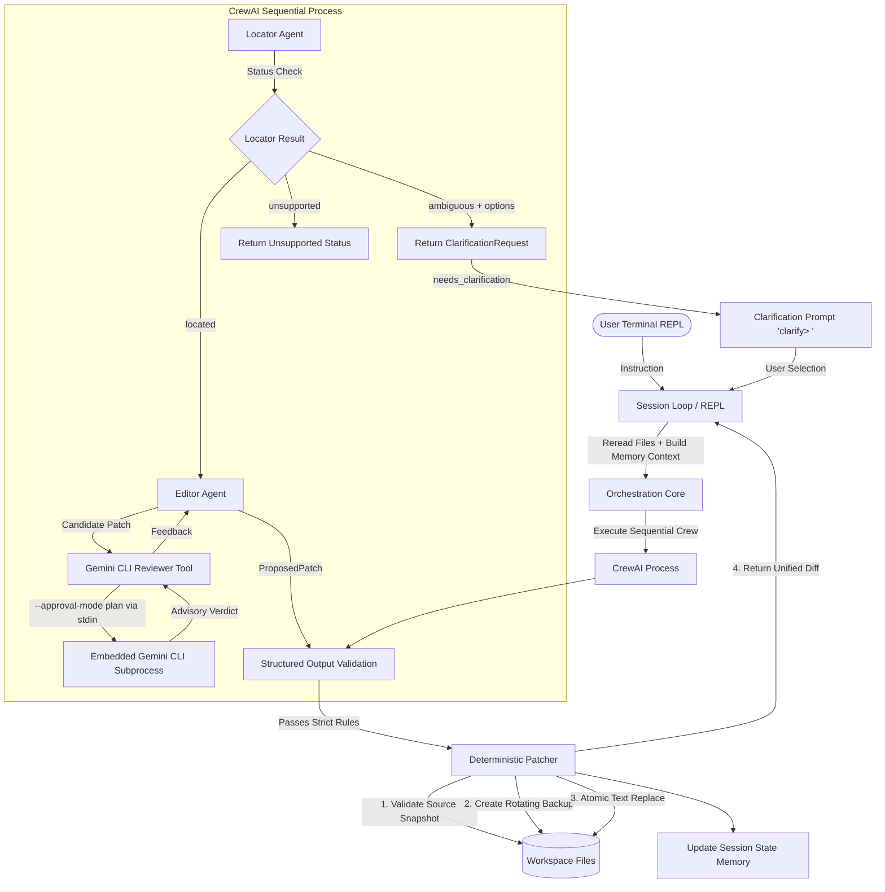

# CrewAI Conversational HTML/CSS Editing Agent

A specialized, local-first conversational CLI editing agent built with Python, CrewAI, Pydantic, Groq, an embedded read-only Gemini CLI patch reviewer, and interactive conversational clarification workflows. The agent accepts natural language editing requests in a long-running terminal session and applies exact, single-file HTML or CSS modifications deterministically.

---

## Table of Contents

- [Overview](#overview)
- [Scope & Exclusions](#scope--exclusions)
- [Architecture](#architecture)
- [Conversational Clarification Workflow (Phase 9)](#conversational-clarification-workflow-phase-9)
- [Gemini CLI Patch Reviewer (Phase 8)](#gemini-cli-patch-reviewer-phase-8)
- [Per-Turn Execution Flow](#per-turn-execution-flow)
- [Repository Structure](#repository-structure)
- [Requirements](#requirements)
- [Setup & Installation](#setup--installation)
- [Environment Configuration](#environment-configuration)
- [Model Selection](#model-selection)
- [Usage](#usage)
- [Conversational Editing & Memory](#conversational-editing--memory)
- [Safety Guarantees](#safety-guarantees)
- [Testing](#testing)
- [Restoring Workspace](#restoring-workspace)
- [Troubleshooting](#troubleshooting)

---

## Overview

The **CrewAI Conversational HTML/CSS Editing Agent** provides a terminal REPL loop where users interactively edit allowed workspace HTML and CSS files using plain English.

Unlike unconstrained code-generation assistants, this project operates under strict safety and determinism boundaries:
- **Two-Agent Crew**: A **Locator** agent finds the target file and exact source substring; an **Editor** agent produces a single precise replacement patch.
- **Conversational Clarification Workflow**: Interactive disambiguation prompts when an instruction matches multiple candidate elements.
- **Embedded Read-Only Gemini Reviewer**: An optional Gemini CLI tool reviews candidate patches in read-only plan mode before editor confirmation.
- **Deterministic Validation & Execution**: Python validates all structural and path constraints, generates rotating backups (`.bak`), applies atomic writes, and renders unified diffs.
- **Strict Structured Outputs**: Pydantic models strictly enforce data shapes and prohibit arbitrary LLM text formats.
- **Local-First & Reread Source**: Workspace HTML/CSS files are reread directly from disk on every single turn to maintain the true file state.

---

## Scope & Exclusions

### In-Scope Capabilities
- Direct single-turn HTML edits (text content, attribute values, tags).
- Direct single-turn CSS edits (property values, selectors, declarations).
- Conversational follow-up requests ("Make it bigger", "Change the same button again", "Even darker").
- Interactive clarification flow for ambiguous requests with candidate targets.
- Advisory read-only patch reviewing via embedded Gemini CLI (`--approval-mode plan`).
- Rejection of ambiguous, out-of-scope, or dangerous instructions with clear user feedback.
- Automatic rotating file backup creation (`index.html.bak`, `index.html.bak.1`).
- Unified diff output display for applied edits.

### Explicit Exclusions
- **No JavaScript support**: JavaScript files (`.js`) and inline event handlers are strictly out of scope and rejected without clarification.
- **No multi-file edits**: Exactly one file is edited per turn. Requests spanning multiple files are rejected.
- **No visual rendering or browser automation**: Execution is terminal-based without browser drivers or DOM layout calculation.
- **No unconstrained code generation**: All edits must match existing source content exactly.
- **No filesystem writes during clarification**: No files are modified while a clarification is pending.

---

## Architecture

The project follows a modular, pipeline-based design:



---

## Conversational Clarification Workflow (Phase 9)

### Objective & Behavior
When an instruction is ambiguous because multiple elements could match (e.g., "Change the link text" when multiple links exist), the agent enters clarification mode:

```text
web-editor> Change the link text.

Which link should I change?
1. Brand link: Weft Studio
2. Navigation link: Work
3. CTA link: Start a project

Enter an option number or target label.
Type 'cancel' to cancel this clarification.

clarify> 3

Resolved clarification:
  Original request: Change the link text.
  Selected target: CTA link: Start a project

Rereading current files and running the editing crew...
Applied: Change the CTA link text.
File: index.html
Backup: index.html.bak
Diff:
...
```

### Safety Rules & Guarantees
- **No Files Written During Clarification**: Source files and backups are untouched until a unique target is resolved and validated.
- **Reread & Rerun**: Selecting an option triggers a fresh reread of files from disk and reruns the locator/editor crew with a clarified instruction.
- **Memory Separation**: Clarification state is process-local and kept separate from successful turn history.
- **Unsupported Requests Not Clarified**: JavaScript, broad redesigns, multi-file edits, and disallowed paths remain `unsupported` and are rejected directly without entering clarification.
- **`cancel` Command**: Typing `cancel` at the `clarify> ` prompt clears pending clarification and returns to normal `web-editor> ` mode.
- **Max Attempts**: Up to 3 invalid selection attempts are allowed before clarification auto-cancels.

---

## Gemini CLI Patch Reviewer (Phase 8)

### Read-Only Plan Mode Guarantee
When `GEMINI_CLI_ENABLED=true`, the Editor agent invokes `GeminiCliReviewTool` using:
```bash
gemini --model <configured model> --approval-mode plan --output-format json --prompt <fixed prompt>
```
- Operates strictly in read-only plan mode (`--approval-mode plan`).
- Runs only after clarification resolves a unique located target and candidate patch.
- Python remains the single authoritative writer.

---

## Repository Structure

```
.
├── src/
│   └── web/
│       ├── __init__.py
│       ├── main.py            # CLI entry point (`web`)
│       ├── session.py         # Terminal REPL loop with clarify> prompt
│       ├── orchestration.py   # Turn processing and crew execution wrapper
│       ├── clarification.py   # Process-local clarification state manager (Phase 9)
│       ├── crew.py            # CrewAI Agents and Tasks configuration
│       ├── models.py          # Pydantic schemas (LocatorResult, ProposedPatch, ClarificationRequest)
│       ├── state.py           # SessionState memory and history limit
│       ├── settings.py        # Environment & pydantic-settings config
│       ├── tools/
│       │   ├── __init__.py
│       │   ├── gemini_cli_tool.py # Read-only Gemini CLI patch reviewer tool
│       │   └── patcher.py     # Deterministic backup, diff & atomic replace
│       └── workspace/         # Default target web workspace
│           ├── index.html
│           └── style.css
├── tests/
│   ├── test_clarification.py            # Phase 9 unit tests
│   ├── test_clarification_integration.py# Phase 9 integration tests
│   ├── test_crew.py
│   ├── test_gemini_cli_integration.py # Phase 8 integration tests
│   ├── test_gemini_cli_tool.py        # Phase 8 tool & settings tests
│   ├── test_integration.py   # End-to-end mocked integration tests
│   ├── test_models.py
│   ├── test_orchestration.py
│   ├── test_patcher.py
│   ├── test_reliability.py
│   ├── test_session.py
│   ├── test_settings.py
│   ├── test_state.py
│   └── test_validation.py
├── .env.example               # Template environment configuration
├── pyproject.toml             # Project setup and dependencies
├── DEMO.md                    # Supervisor demonstration script
└── README.md                  # Project documentation
```

---

## Testing

Run all unit and integration tests (149+ tests, 100% mocked LLM calls):

```bash
uv run pytest tests/ -v
```

Run Phase 9 clarification tests only:

```bash
uv run pytest tests/test_clarification.py tests/test_clarification_integration.py -v
```
