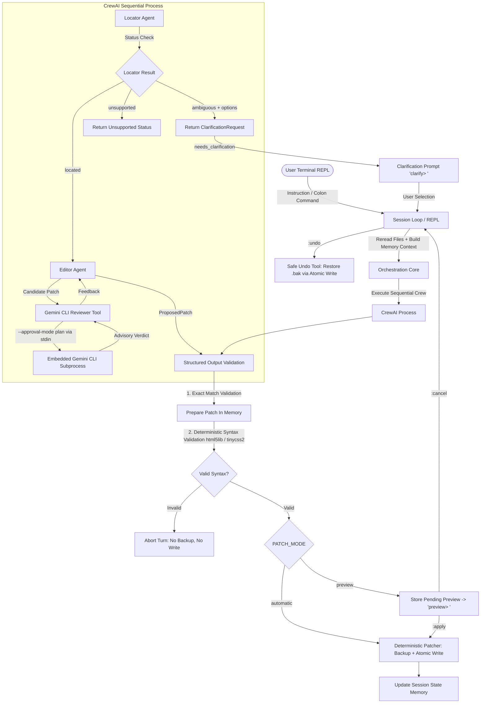

# CrewAI Conversational HTML/CSS Editing Agent

A specialized, local-first conversational CLI editing agent built with Python, CrewAI, Pydantic, Groq, an embedded read-only Gemini CLI patch reviewer, interactive clarification workflows, deterministic HTML/CSS syntax validation (`html5lib` & `tinycss2`), patch preview mode, and safe undo capabilities.

---

## Table of Contents

- [Overview](#overview)
- [Scope & Exclusions](#scope--exclusions)
- [Architecture](#architecture)
- [Phase 10: Preview, Validation & Recovery](#phase-10-preview-validation--recovery)
- [Conversational Clarification Workflow (Phase 9)](#conversational-clarification-workflow-phase-9)
- [Gemini CLI Patch Reviewer (Phase 8)](#gemini-cli-patch-reviewer-phase-8)
- [Per-Turn Execution Flow](#per-turn-execution-flow)
- [Repository Structure](#repository-structure)
- [Requirements](#requirements)
- [Setup & Installation](#setup--installation)
- [Environment Configuration](#environment-configuration)
- [REPL Colon Commands](#repl-colon-commands)
- [Safety Guarantees](#safety-guarantees)
- [Testing](#testing)
- [Restoring Workspace](#restoring-workspace)
- [Troubleshooting](#troubleshooting)

---

## Overview

The **CrewAI Conversational HTML/CSS Editing Agent** provides a terminal REPL loop where users interactively edit allowed workspace HTML and CSS files using plain English.

Unlike unconstrained code-generation assistants, this project operates under strict safety and determinism boundaries:
- **Two-Agent Crew**: A **Locator** agent finds the target file and exact source substring; an **Editor** agent produces a single precise replacement patch.
- **Deterministic Syntax Validation**: Python parses complete resulting HTML (`html5lib`) and CSS (`tinycss2`) documents before backup or write.
- **Preview & Automatic Modes**: `PATCH_MODE=preview` displays validated diffs for user confirmation via `:apply` or `:cancel`.
- **Safe Undo**: `:undo` restores previous source file versions from rotating backups using atomic replacement and reverse diffs.
- **Conversational Clarification Workflow**: Interactive disambiguation prompts when an instruction matches multiple candidate elements.
- **Embedded Read-Only Gemini Reviewer**: An optional Gemini CLI tool reviews candidate patches in read-only plan mode (`--approval-mode plan`).
- **Strict Structured Outputs**: Pydantic models strictly enforce data shapes and prohibit arbitrary LLM text formats.
- **Local-First & Reread Source**: Workspace HTML/CSS files are reread directly from disk on every single turn.

---

## Architecture



---

## Phase 10: Preview, Validation & Recovery

### 1. Deterministic Syntax Validation
- **HTML**: Complete resulting HTML parsed with `html5lib`. Catches malformed tags, duplicate attributes, and structural errors.
- **CSS**: Complete resulting CSS parsed with `tinycss2`. Inspects rules, `@media` queries, `@supports`, and declarations.
- **Validation-Before-Backup Guarantee**: Syntax validation runs on the complete updated source *in memory* before any backup file or write operation occurs.

### 2. Patch Preview Mode (`PATCH_MODE=preview`)
When `PATCH_MODE=preview` is enabled:
- Candidate patches are prepared, syntax-validated, and displayed as unified diffs.
- Prompt switches to `preview> `.
- Typing `:apply` commits the prepared patch to disk, creates the `.bak` backup, and records successful memory.
- Typing `:cancel` discards the preview without touching files.

### 3. Safe Undo (`:undo`)
- Restores an allowlisted HTML/CSS file from its newest rotating backup (`.bak`).
- Rotates existing backups so pre-undo source becomes the new `.bak` (allowing undoing an undo).
- Displays a reverse unified diff.
- Runs 100% deterministically without calling LLMs or external services.

---

## REPL Colon Commands

| Command | Description |
| :--- | :--- |
| `:status` | Displays patch mode, syntax validation status, clarification/preview state, and retained turns without exposing secrets. |
| `:preview` | Displays the current pending preview diff and summary. |
| `:apply` | Commits the pending preview patch to disk. |
| `:cancel` | Cancels pending clarification or preview mode. |
| `:undo [file]` | Restores an allowlisted file from its newest backup (e.g. `:undo index.html` or `:undo`). |

---

## Environment Configuration

Updated `.env` settings:

```env
GROQ_API_KEY=gsk_your_actual_groq_api_key_here
GROQ_MODEL=groq/llama-3.3-70b-versatile
PROJECT_ROOT=src/web/workspace
ALLOWED_FILES=index.html,style.css
BACKUP_LIMIT=3
SESSION_HISTORY_LIMIT=5

# Gemini CLI read-only patch reviewer settings (Phase 8)
GEMINI_API_KEY=your_gemini_api_key
GEMINI_CLI_ENABLED=true

# Phase 10: Preview mode and syntax validation settings
PATCH_MODE=automatic
SYNTAX_VALIDATION_ENABLED=true
HTML_VALIDATION_ENABLED=true
CSS_VALIDATION_ENABLED=true
```

---

## Testing

Run all unit and integration tests (180+ tests, 100% mocked LLM calls):

```bash
python -m pytest tests/ -v
```

Run Phase 10 tests only:

```bash
python -m pytest tests/test_syntax_validator.py tests/test_preview.py tests/test_undo.py tests/test_phase10_integration.py -v
```
